# Operationalizing Machine Learning

In this project we use the Bank Marketing dataset to train machine learning models on AzureML for a classification task. Two approaches are used to operationalize: one is an AutoML run and the other is a pipeline run. The model with the highest accuracy rate is deployed as an endpoint as an Azure Container Instance (ACI). Through the ACI, the REST endpoint with authentication is used to access the model via API documentation enabled by Swagger.

## Architectural Diagram

As the diagram shows, the dataset is loaded into the AutoML run as well as the pipeline through the Jupyter notebook as a registered dataset. It is then trained and deployed manually on the AutoML run and the same process is automated via the Python SDK in the Jupyter notebook. The pipeline enables us to automate the AutoML runs on a compute cluster and outputs a best model as well as a pipeline endpoint. The best model then gets deployed as an ACI endpoint. From our endpoint, we get API Documentation via Swagger, logging via Application Insight. At the end, users interact with our model through either the pipeline endpoint, or the ACI. They also interact with the API, logs, and performance metrics.

## Key Steps 

## 1. Upload and Register Dataset 
The first step is to upload the [Bank Marketing dataset](https://automlsamplenotebookdata.blob.core.windows.net/automl-sample-notebook-data/bankmarketing_train.csv) and register it on the ML Studio

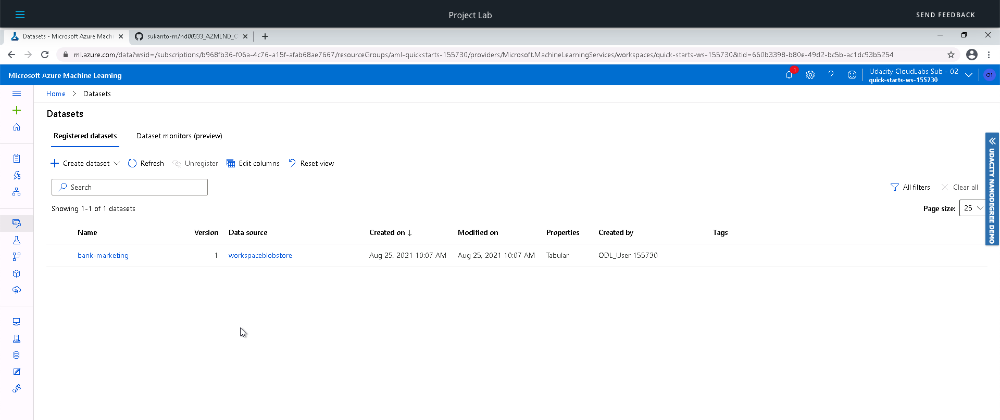

## 2. AutoML run on compute cluster

In the next step, the automated ML run is initiated by configuring a compute cluster and selecting the uploaded dataset for the experiment. The completed experiment goes through some iterations and outputs a best model.

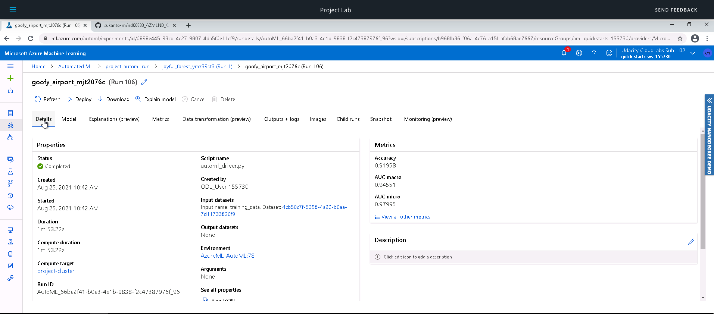

## 3. Best performing model

The best model is a collection of classifiers - Voting Ensemble - with an accuracy of nearly 92%.

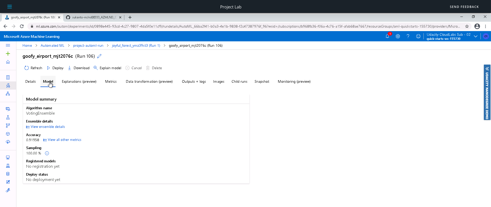

## 4. Deploy the best model

We now proceed to deploy the best model as an Azure Container Instance with authentication enabled.

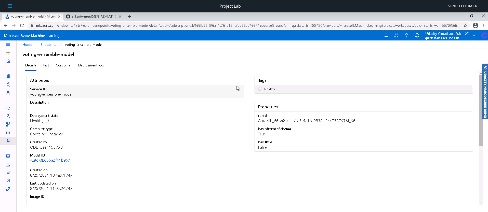

## 5. Enable logging and view logs

The deployed model is updated to enable logging of application insights. The logs can be viewed by running the logs.py script.

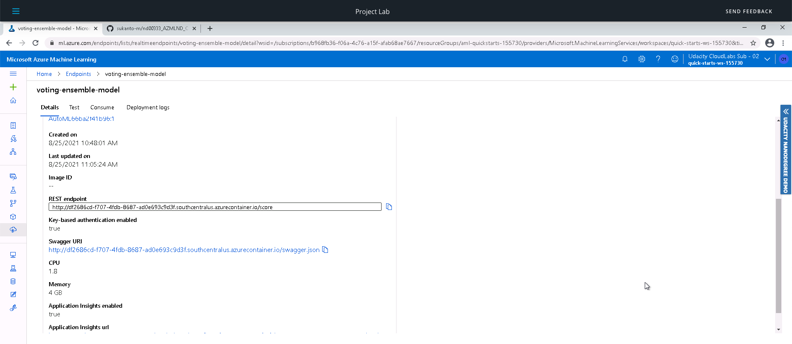
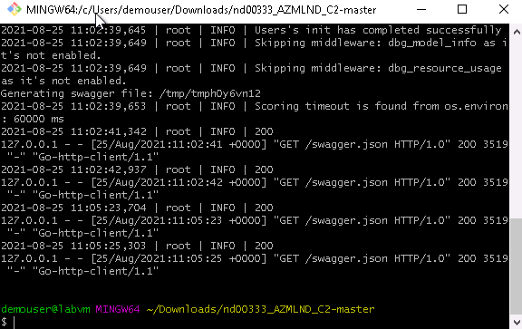

## 6. Swagger documentation of API and endpoints

The deployed model API documentation is served up on Swagger. The model endpoints can be consumed via HTTP requests and a JSON input payload by running the endpoint.py script.

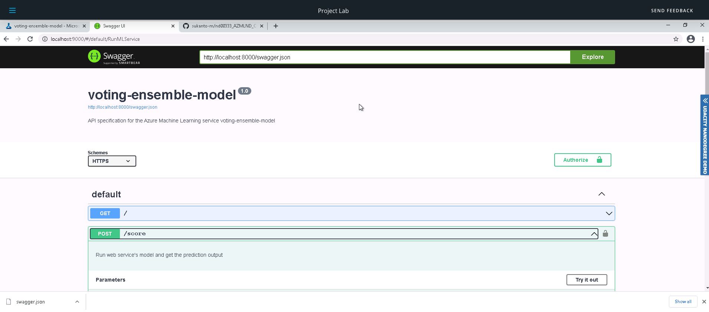
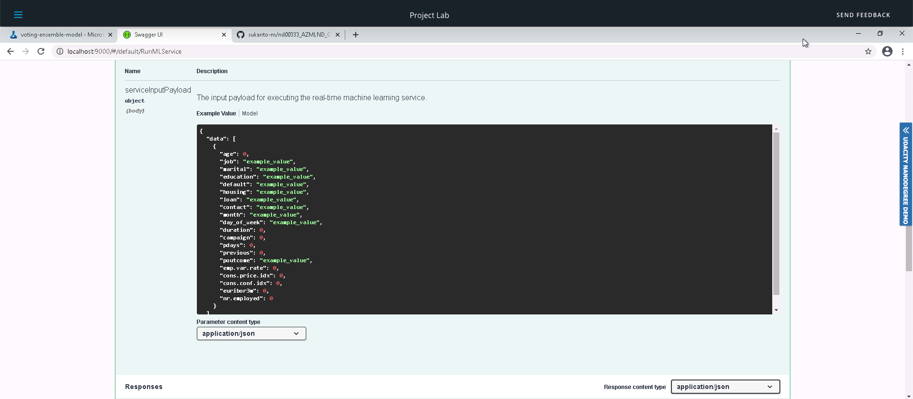
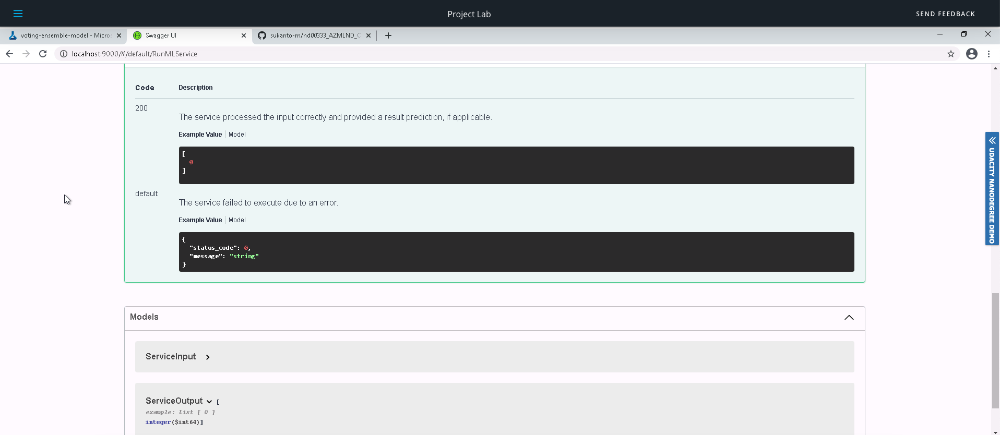

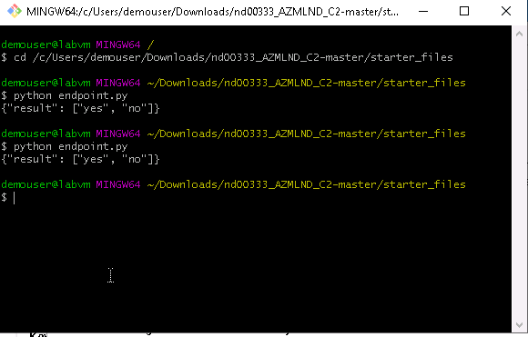

## 7. Pipeline run via Jupyter notebook

This is the second part of operationalising where the experiment is run via pipeline powered by the Python SDK. A Jupyter notebook runs with the same compute cluster attached as in the AutoML run and the same dataset as before. The details can be viewed via the RunDetails widget and the dataset shows up as an AutoML module in the pipeline. 

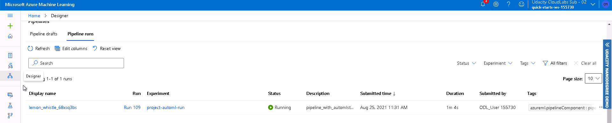

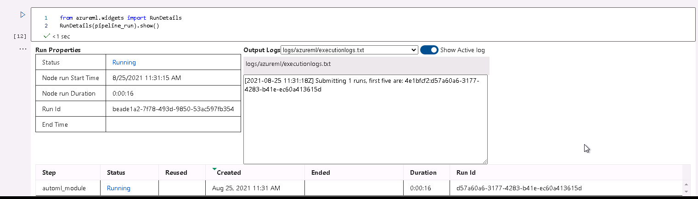

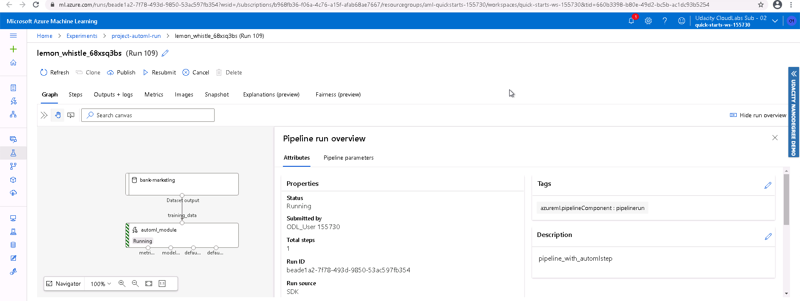

## 10. Publish pipeline and deploy as endpoint

Once the pipeline run completes, the pipeline can be published with an endpoint to enable automation of the task if it is needed again. The published pipeline status and endpoint can be viewed on the ML Studio as well as a scheduled run with the said pipeline

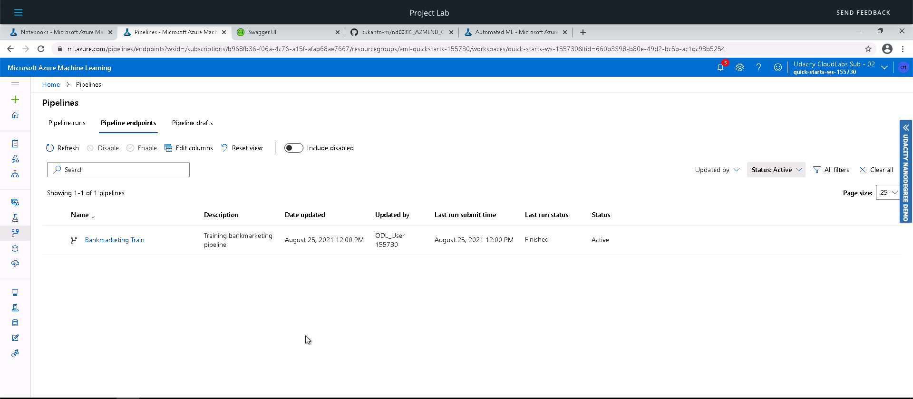
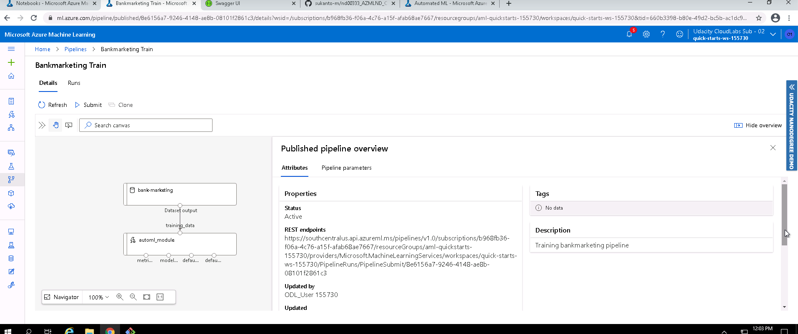
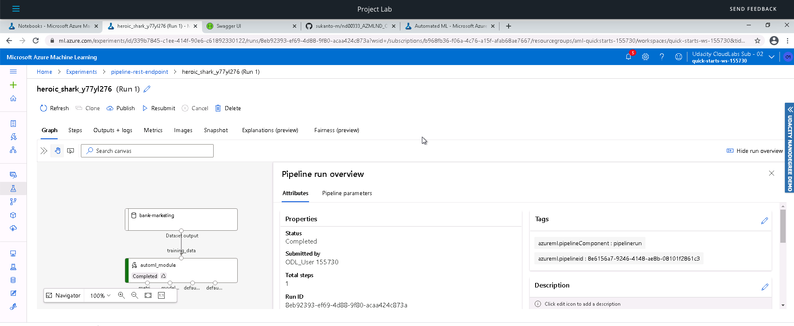

## Screen Recording

Link to screencast: https://youtu.be/WhWt4R1jW2k

# Suggestions on improving the project

The dataset shows a class imbalance during the run so that can be addressed by balanced data collection, since a model performs only as well as its data. Metrics other than accuracy can also be used to improve the model performance.
